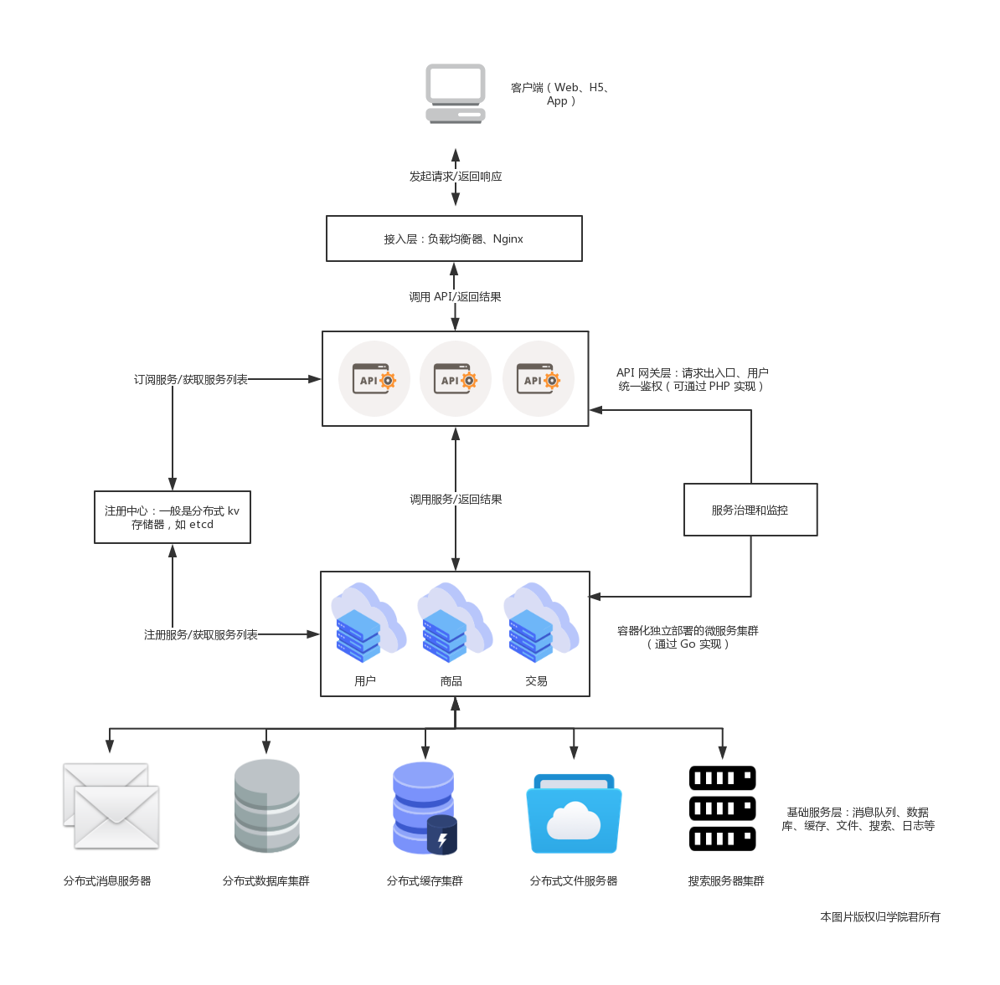
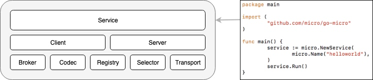
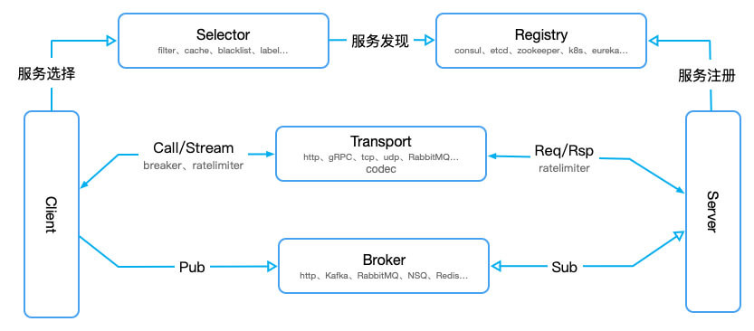

# [微服务基础知识](https://laravelacademy.org/post/20964)  
## 微服务 vs 服务化
其实在微服务之前，还有服务化的概念，主要应用在 Java 项目中，把传统单机应用通过 JAR 包依赖产生的本地方法调用，改造成通过 RPC 接口产生的远程方法调用，不同的功能模块拆分成独立的服务模块单独部署，以 RPC 接口的形式对外提供服务，这些拆分后的服务模块也是单独开发、测试、部署和运维的。看起来服务化已经解决了单体应用的问题，为什么还会出现微服务呢？

微服务其实是服务化的延伸，从 2014 年开始，得益于以 Docker 为代表的容器化技术的成熟以及 DevOps 文化的兴起，服务化的思想进一步演化，演变为今天我们所熟知的微服务。

那么微服务相比于服务化又有什么不同呢？大体可以总结为以下四点：
- 服务拆分粒度更细：微服务可以说是更细维度的服务化，小到一个子模块，只要该模块依赖的资源与其他模块都没有关系，那么就可以拆分为一个微服务；
- 服务独立部署：每个微服务都严格遵循独立打包部署的准则，互不影响，比如一台物理机上可以部署多个 Docker 实例，每个 Docker 实例可以部署一个微服务的代码；
- 服务独立维护：每个微服务都可以交由一个小团队甚至个人来开发、测试、发布和运维，并对整个生命周期负责；
- 服务治理能力要求高：因为拆分为微服务之后，服务的数量变多，因此需要有统一的服务治理平台，来对各个服务进行管理。

## 微服务架构的定义
其实从业界的讨论来看，微服务本身并没有一个严格的定义。不过，ThoughtWorks 的首席科学家 Martin Flowler 的描述更加通俗易懂：
> 微服务架构是一种架构模式，它提倡将单一应用程序划分成一组小的服务，服务之间互相协调、互相配合，为用户提供最终价值。每个服务运行在其独立的进程中，服务和服务间采用轻量级的通信机制互相沟通（通常是基于 HTTP 的 RESTful API）。每个服务都围绕着具体业务进行构建，并且能够被独立地部署到生产环境、类生产环境等。另外，应尽量避免统一的、集中式的服务管理机制，对具体的一个服务而言，应根据业务上下 文，选择合适的语言、工具对其进行构建。  
> —— 摘自马丁·福勒先生的博客，微服务的概念最早即来源于此。

## 总体设计
看完微服务的定义后，接下来我们一起走进微服务架构，来看看它的总体设计和各个组成部分。在具体介绍之前先来看下微服务架构的整体架构图和一次正常的服务调用的完整流程：

   

首先服务提供者（用户、商品等微服务子模块）按照指定格式的服务接口描述，向注册中心注册服务，声明自己能够提供哪些服务以及服务的地址是什么，完成服务发布。

接下来服务消费者（API 网关层或者相邻的其它微服务模块）请求注册中心，查询所需要调用服务的地址，然后以约定的通信协议向服务提供者发起请求，得到请求结果后再按照约定的协议解析结果。

在服务调用过程中，服务的请求耗时、调用量以及成功率等指标都会被记录下来用作监控，调用经过的链路信息会被记录下来，用于故障定位和问题追踪。在这期间，如果调用失败，可以通过重试等服务治理手段来保证成功率。

所以总结起来，微服务架构下，服务调用主要依赖下面几个基本组件：

- 注册中心：注册并维护远程服务及服务提供者的地址，供服务消费者发现和调用，为保证可用性，通常基于分布式 kv 存储器来实现，比如 zookeeper、etcd 等；
- 服务框架：用于实现微服务的 RPC 框架，包含服务接口描述及实现方案、向注册中心发布服务等功能，常见的 RPC 框架包括 Spring Cloud、Dubbo、gRPC、 Thrift、go-micro 等；
- 服务网关：介于客户端与微服务之间的网关层，可以理解为「门卫」的角色，以确保服务提供者对客户端的透明，这一层可以进行反向路由、安全认证、灰度发布、日志监控等前置动作；
- 服务监控：对服务消费者与提供者之间的调用情况进行监控和数据展示；   
- 服务追踪：记录对每个请求的微服务调用完整链路，以便进行问题定位和故障分析；  
- 服务治理：服务治理就是通过一系列的手段来保证在各种意外情况下，服务调用仍然能够正常进行，这些手段包括熔断、隔离、限流、降级、负载均衡等。  
- 基础设施：分布式消息队列、日志存储、数据库、缓存、文件服务器、搜索集群等，用以提供服务底层的基础数据服务，可以自建，也可以使用阿里云等公有云提供的服务。  
此外，从微服务部署角度来说，我们通常会基于容器编排技术实现微服务的运维。  

## Go Micro 简介与设计理念
Go Micro 是一个基于 Go 语言编写的、用于构建微服务的基础框架，提供了分布式开发所需的核心组件，包括 RPC 和事件驱动通信等。

它的设计哲学是「可插拔」的插件化架构，其核心专注于提供底层的接口定义和基础工具，这些底层接口可以兼容各种实现。例如 Go Micro 默认通过 consul 进行服务发现，通过 HTTP 协议进行通信，通过 protobuf 和 json 进行编解码，以便你可以基于这些开箱提供的组件快速启动，但是如果需要的话，你也可以通过符合底层接口定义的其他组件替换默认组件，比如通过 etcd 或 zookeeper 进行服务发现，这也是插件化架构的优势所在：不需要修改任何底层代码即可实现上层组件的替换。  

## Go Micro 基础架构介绍
Go Micro 框架的基础架构如下，由 8 个核心接口组成，每个接口都有默认实现：  
   

- 最顶层的 `Service` 接口是构建服务的主要组件，它把底层的各个包需要实现的接口，做了一次封装，包含了一系列用于初始化 Service 和 Client 的方法，使我们可以很简单的创建一个 RPC 服务；
- `Client` 是请求服务的接口，从 `Registry` 中获取 `Server` 信息，然后封装了 Transport 和 Codec 进行 RPC 调用，也封装了 Brocker 进行消息发布，默认通过 RPC 协议进行通信，也可以基于 HTTP 或 gRPC；
- `Server` 是监听服务调用的接口，也将以接收 `Broker` 推送过来的消息，需要向 Registry 注册自己的存在与否，以便客户端发起请求，和 Client 一样，默认基于 RPC 协议通信，也可以替换为 HTTP 或 gRPC；
- `Broker` 是消息发布和订阅的接口，默认实现是基于 HTTP，在生产环境可以替换为 Kafka、RabbitMQ 等其他组件实现；
- `Codec` 用于解决传输过程中的编码和解码，默认实现是 protobuf，也可以替换成 json、mercury 等；
- `Registry` 用于实现服务的注册和发现，当有新的 `Service` 发布时，需要向 `Registry` 注册，然后 Registry 通知客户端进行更新，Go Micro 默认基于 consul 实现服务注册与发现，当然，也可以替换成 etcd、zookeeper、kubernetes 等；
- `Selector` 是客户端级别的负载均衡，当有客户端向服务端发送请求时，`Selector` 根据不同的算法从 Registery 的主机列表中得到可用的 Service 节点进行通信。目前的实现有循环算法和随机算法，默认使用随机算法，另外，Selector 还有缓存机制，默认是本地缓存，还支持 label、blacklist 等方式；
- `Transport` 是服务之间通信的接口，也就是服务发送和接收的最终实现方式，默认使用 HTTP 同步通信，也可以支持 TCP、UDP、NATS、gRPC 等其他方式。

Go Micro 官方创建了一个 Plugins 仓库，用于维护 Go Micro 核心接口支持的可替换插件：  

|  接口   | 支持组件  |
|  ----  | ----  |
| Broker  | NATS、NSQ、RabbitMQ、Kafka、Redis 等 |
| Client  | gRPC、HTTP |
| Codec | BSON、Mercury 等 |
| Registry | Etcd、NATS、Kubernetes、Eureka 等 |
| Selector | Label、Blacklist、Static 等 |
| Server | gRPC、HTTP |
| Transport | NATS、gPRC、RabbitMQ、TCP、UDP |
| Wrapper | 中间件：熔断、限流、追踪、监控 |  

各个组件接口之间的关系可以通过下图串联：  

   

## 基于 Go Micro 框架构建一个简单的微服务接口  
可以下载指定版本的，不同版本依赖的micro版本不一样: https://github.com/microhq/examples/tree/master/helloworld 

### 创建项目  
创建一个hello项目  

### [protobuf工具链](https://github.com/microhq/protoc-gen-micro)    
#### 首先安装protoc
可以从这里 https://github.com/protocolbuffers/protobuf/releases 下载最新版的 protoc： 

#### protoc-gen-go
在hello根目录下安装: 
```
// 仓库地址: https://github.com/golang/protobuf/blob/master/go.mod  
go get -u github.com/golang/protobuf/protoc-gen-go
```


#### 安装protoc-gen-micro  
```
go get github.com/micro/protoc-gen-micro/v2
```

### 服务发现  
接下来，我们设置基于 Consul 进行服务发现，为此，需要在系统中安装 Consul，可以从 Consul 下载页面 选择与自己系统匹配的下载包下载（比如这里学院君选择的是 macOS 64-bit）：  

```
brew install consul
```  

查看版本
```
$ consul version

Consul v1.10.2
Revision 3cb6eeedb
Protocol 2 spoken by default, understands 2 to 3 (agent will automatically use protocol >2 when speaking to compatible agents)
```  

### 编写服务 
至此，微服务所依赖的基本工具都已经安装设置好了，下面我们来编写一个微服务接口。

#### 创建服务接口原型
在 hello/src 目录下新建一个 hello 子目录，并在该 hello 子目录下创建一个 proto 目录，
然后在 proto 目录下创建一个服务接口原型文件 `greeter.proto`，我们通过 protobuf 定义服务接口如下：

```
syntax = "proto3";

option go_package="./proto";

service Greeter {
	rpc Hello(HelloRequest) returns (HelloResponse) {}
}

message HelloRequest {
	string name = 1;
}

message HelloResponse {
	string greeting = 2;
}
```

如上述代码所示，我们定义了一个名为 Greeter 的服务，该服务中包含一个 Hello 方法，该方法接收一个 HelloRequest 对象，然后返回一个 HelloResponse 对象，这两个对象都只包含一个参数。  

#### 通过工具生成代码  
接下来需要通过`protoc`工具通过接口原型生成相应的服务代码  

```
$ cd hello/src/hello
$ protoc --plugin=protoc-gen-go=$GOPATH/bin/protoc-gen-go --plugin=protoc-gen-micro=$GOPATH/bin/protoc-gen-micro --proto_path=$GOPATH/src:. --micro_out=. --go_out=. greeter.proto
```

文件列表:
```
└── proto
    ├── greeter.pb.go            # original protobuf file
    ├── greeter.pb.micro.go      # auto-generated by protoc-gen-go
    └── greeter.proto            # auto-generated by protoc-gen-micro
```
其中 `greeter.pb.go` 由 `protoc-gen-go` 生成，包含了 `HelloRequest` 和 `HelloResponse` 类代码；
`greeter.micro.go` 由 `protoc-gen-micro` 生成，包含了 `Greeter` 服务相关的实现代码。  


#### 编写服务端代码  
接下来，我们在 hello/src/hello 创建一个 main.go 用作服务端入口：  


#### 启动服务端  
由于我们在代码中引入了远程的包，所以在启动服务端之前，需要先安装这个依赖：
```
go get github.com/micro/go-micro
```

然后启动 Consul 代理，以便服务端启动时可以将服务注册到 Consul 中，从而被客户端调用： 


> IDEA显示不正常: goproject Unresolved reference 'Println'  
> I experienced a similar issue, but it was a lot more prevalent. Even things like fmt.Printf() were showing as unresolved. Was able to resolve the issue by going to File -> Invalidate Caches / Restart.  


